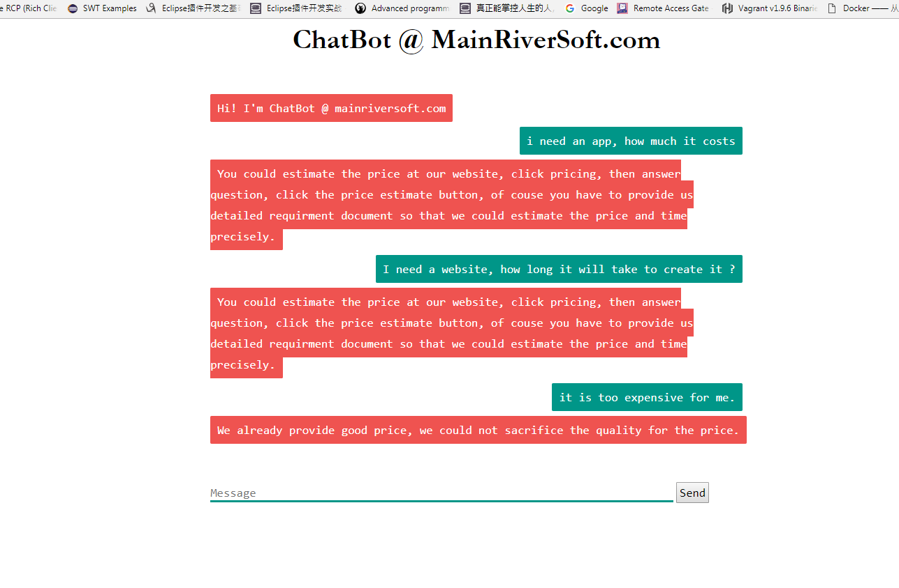

## Test of chatbot

### install and activate virtualenv

- create a python virtualenv  
 source <virtualenv>bin/activate
 
### install dependency

- pip install Flask chatterbot  
- pip install -r requirements.txt

### start app.py  
- run chatbot  as web serivce  
   cd <chatbot_dir>  
   python app.py

- start to input question and test  
  

- all js css file must be put at static folder so that could be included by index.html with flask framework

### Open tasks, 

- deploy it to server 

- integrate with mainriversoft.com as chatbot

